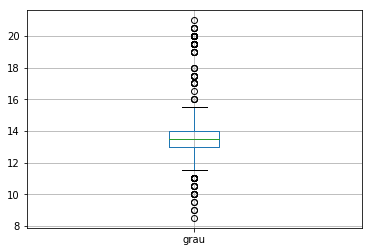
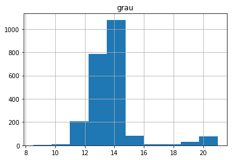
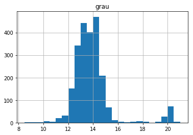

Vamos continuar a olhar os dados das edições que vão de Junho de 2017 a Maio de 2018, da ["Vinho Grandes Escolhas"](https://grandesescolhas.com/). Continuámos no [post anterior]() a utilizar o **Pandas** e hoje vamos olhar um pouco para o seu potencial de visualização de dados.

```python
import pandas as pd
%matplotlib inline

vinhos = pd.read_excel('output_analise/vinhos.xlsx')
```

O **Pandas** tem também incluídos métodos muito práticos para visualização de dados. Na realidade tratam-se de *wrappers* de métodos de [**Matplotlib**](https://matplotlib.org/), a biblioteca fundamental de visualização de dados em **Python**, e que é a base de muitas outras.

Podemos começar pelo **boxplot**, cuja caixa representa a mediana e os dois quartis da variável - neste caso o **grau**.


```python
vinhos.boxplot(['grau'])
```


![png] (https://github.com/hugo-pires/hugo-pires.github.io/blob/master/_posts/blog_quarto_files/blog_quarto_4_1.png)


Ao que parece há um vinho com **0 graus**. Trata-se, com certeza, de um erro, que poderemos corrigir facilmente:

```python
vinhos = vinhos[vinhos['grau'] != 0]
```

```python
vinhos.boxplot(['grau'])
```



Podemos também eliminar graduações acima de **25 graus** para poder fazer outro tipo de análise:

```python
vinhos = vinhos[vinhos['grau'] < 25]
```

```python
vinhos.hist(['grau'])
```



Um histograma, ao qual podemos alterar o número de divisões...

```python
vinhos.hist(['grau'], bins=25)
```



... para encontrar uma distribuição ligeiramente bimodal, com os vinhos de mesa perto dos **14 graus** e os generosos perto dos **20 graus**.

```python
vinhos_perto_de_20 = vinhos[(19 < vinhos['grau']) & (vinhos['grau']< 21)]
```

```python
vinhos_perto_de_20['regiao'].value_counts()
```

    Porto       98
    Setúbal      2
    Madeira      1
    Alentejo     1
    Palmela      1
    Name: regiao, dtype: int64

Estes são **Vinhos do Porto**, na sua maioria, com seria de esperar.
