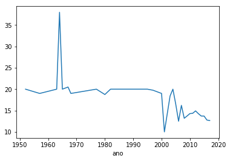
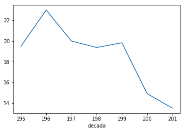

Vamos continuar a olhar os dados das edições da ["Vinho Grandes Escolhas"](https://grandesescolhas.com/) que vão de Junho de 2017 a Maio de 2018. Continuámos no [post anterior]() a utilizar o **Pandas** e hoje vamos ver o seu potencial a criar grupos de dados e a fazer comparações entre eles.

```python
import pandas as pd
%matplotlib inline

vinhos = pd.read_excel('output_analise/vinhos.xlsx')
```

Até agora, temos feito filtragem dos dados, por exemplo ao nível região, e aproveitado para fazer algumas comparações. Já usámos também o método ```value_counts()``` para identificar os valores de uma variável qualitativa. Mas o **Pandas** tem um conjunto de ferramentas mais poderoso para fazer este conjunto de tarefas, agrupando, por exemplo, pelo **ano** do vinho.

```python
por_ano = vinhos.groupby('ano')
por_ano
```

```python
<pandas.core.groupby.groupby.DataFrameGroupBy object at 0x7eff94103e80>
```

Construímos assim um objecto que podemos utilizar em análise futura, calculando a **média** da coluna **grau**.

```python
por_ano['grau'].mean()
```

    ano
    0       17.575904
    1000    14.428571
    1952    20.000000
    1957    19.000000
    1963    20.000000
    1964    38.000000
    1965    20.000000
    1967    20.500000
    1968    19.000000
    1977    20.000000
    1980    18.750000
    1982    20.000000
    1984    20.000000
    1995    20.000000
    1997    19.750000
    1998     0.000000
    1999     6.666667
    2000    19.000000
    2001    10.000000
    2003    18.400000
    2004    20.000000
    2005    16.500000
    2006    12.500000
    2007    16.214286
    2008    13.187500
    2009    13.722222
    2010    14.289474
    2011    14.353659
    2012    14.916667
    2013    14.260177
    2014    13.717884
    2015    13.708833
    2016    12.773777
    2017    12.657895
    Name: grau, dtype: float64

Vinhos do ano **0** e **1000**? E o que aconteceu em **1998** e **1999**?

Não se esqueçam "90% do trabalho de Datasciense é limpeza de dados, os outros 10% é queixarmo-nos da limpeza de dados"...

Vamos retirar aos dados estes erros e repetir o processo.

```python
vinhos_sem_outliers = vinhos[(vinhos['ano'] > 1000) & (vinhos['ano'] != 1998) & (vinhos['ano'] != 1999)]
```

```python
por_ano = vinhos_sem_outliers.groupby('ano')
por_ano['grau'].mean().plot();
```



Para vos mostrar de forma mais clara a tendência que se desenha neste gráfico, vamos construir uma nova *feature* utilizando a facilidade que o **Pandas** tem de construção de novas colunas. Podemos representar a operação vectorialmente, sem necessidade de iterar os valores, utilizando o operador de divisão inteira.

```python
vinhos_sem_outliers['decada'] = vinhos_sem_outliers['ano'] // 10;
por_decada = vinhos_sem_outliers.groupby('decada')
por_decada['grau'].mean().plot();
```



Realmente, é fácil observar que, dos vinhos analisados, os mais velhos têm maior grau - mais uma vez encontrámos os **vinhos generosos**.
