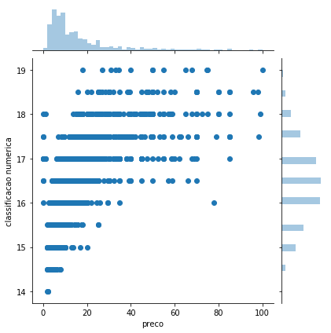
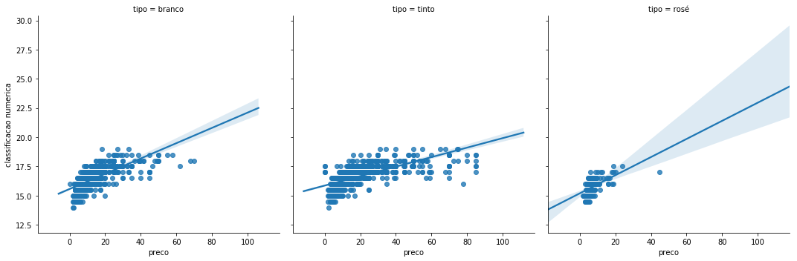

Vamos continuar a olhar os dados das edições que vão de Junho de 2017 a Maio de 2018, da ["Vinho Grandes Escolhas"](https://grandesescolhas.com/). Continuámos no [post anterior]() a utilizar o **Pandas** mas hoje vamos começar, com análise estatística muito simples, a estabelecer relações entre as variáveis.

Para auxiliar neste trabalho vamos recorrer a uma outra biblioteca de visualização, [**Seaborn**](https://seaborn.pydata.org/). Esta é construída com base no sempre presente **Matplotlib**, já utilizado e falado por aqui. Apresenta um conjunto de gráficos preparados a pensar numa análise estatística mais detalhada.


```python
import pandas as pd
import seaborn as sns
from scipy import stats
%matplotlib inline

vinhos = pd.read_excel('output_analise/vinhos.xlsx')
```
*Será que vale a pena comprar um vinho mais caro?* Esta é a questão que vamos tentar responder com base nos nosso dados. Iremos considerar vinhos com **preço até 100 euros**...

```python
vinhos = vinhos[vinhos['preco'] <= 100]
```
e vamos assumir como medida de qualidade a variável **classificacao numerica** atribuída pelos provadores da Revista, eliminando vinhos abaixo de **10** e acima de **20**.

```python
vinhos = vinhos[(vinhos['classificacao numerica'] > 10) & (vinhos['classificacao numerica'] < 20)]
```
Para começar podemos utilizar o **Seaborn** para visualizar a distribuição das duas variáveis que nos interessam num *histograma* um pouco diferente do que nos temos habituado. Este apresenta simultaneamente as distribuições das duas variáveis, permitindo que há uma maior frequência de vinhos abaixo dos **20 euros**. As classificações centram-se à volta de um valor médio de **16.5**.

```python
sns.jointplot(data=vinhos, y='classificacao numerica', x='preco');
```


Há algo que podemos começar a identificar - não existe uma relação muito forte entre as duas variáveis. Tentemos ajustar uma recta de regressão, tendo em conta o **tipo** de vinho para tentar despistar a influência desta última variável.

```python
sns.lmplot(x='preco', y='classificacao numerica', data=vinhos, col='tipo');
```


Vamos então avaliar esta aparente má relação entre as duas variáveis.

```python
stats.pearsonr(vinhos['preco'], vinhos['classificacao numerica'])[0] ** 2
```
    0.4566345766234683

A função *stats* disponibilizada pelo módulo [**Scipy**](https://www.scipy.org/) dá-nos um R<sup>2</sup> muito baixo, comprovando que não conseguimos encontrar uma relação e que nem sempre um vinho mais caro é obrigatoriamente melhor.
