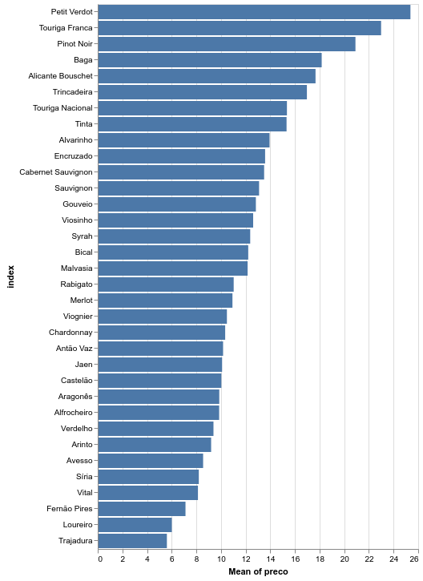
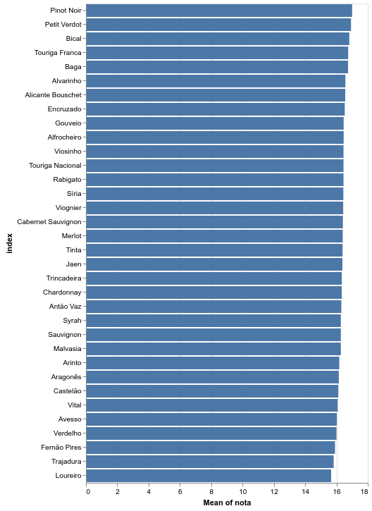

Vamos continuar a olhar os dados das edições que vão de Junho de 2017 a Maio de 2018, da ["Vinho Grandes Escolhas"](https://grandesescolhas.com/). Continuámos no [post anterior]() a utilizar o **Pandas** e hoje vamos começar a tratar as variáveis qualitativas de uma outra forma, encontrando informação quando ela à primeira vista não está disponível.


```python
import numpy as np
import pandas as pd
import altair as alt
%matplotlib inline

vinhos = pd.read_excel('output_analise/vinhos.xlsx')
```

Consideramos também que podemos escolher a casta com que fazemos o vinho. Até que ponto essa escolha influencia a nota obtida e o preço de mercado?

Vamos restringir o *dataset* às variáveis que nos interessam:


```python
vinhos = vinhos[['classificacao numerica', 'preco', 'castas', 'descricao da prova']]
```


```python
vinhos.shape[0], vinhos['castas'].isnull().sum(), vinhos['castas'].notnull().sum()
```


    (2328, 1662, 666)


Dos 2328 vinhos temos disponível informação sobre castas em 666, deixando 1662 de fora. Vamos tentar adicionar alguma informação com base nas descrições de prova. Para tal, construimos uma lista de castas, com base nos valores únicos encontrados na coluna **castas**.


```python
castas = sorted(list(vinhos['castas'].str.split(',', expand=True).stack().unique()))
```

De seguida iremos criar uma nova coluna com as castas que encontramos na coluna **descricao de prova** a que iremos chamar **castas_prova**.


```python
def encontra_casta(x):
    castas_presentes = [c for c in castas if c in x['descricao da prova']]
    return ','.join(castas_presentes)            
```


```python
vinhos['castas_prova'] = vinhos.apply(encontra_casta, axis=1)
```

Como ficam agora os nossos dados?


```python
vinhos.sample(3)
```


<div>
<style scoped>
    .dataframe tbody tr th:only-of-type {
        vertical-align: middle;
    }

    .dataframe tbody tr th {
        vertical-align: top;
    }

    .dataframe thead th {
        text-align: right;
    }
</style>
<table border="1" class="dataframe">
  <thead>
    <tr style="text-align: right;">
      <th></th>
      <th>classificacao numerica</th>
      <th>preco</th>
      <th>castas</th>
      <th>descricao da prova</th>
      <th>castas_prova</th>
    </tr>
  </thead>
  <tbody>
    <tr>
      <th>2063</th>
      <td>17.5</td>
      <td>79.0</td>
      <td>NaN</td>
      <td>Quase alaranjado na cor, com uma assinalável f...</td>
      <td></td>
    </tr>
    <tr>
      <th>2285</th>
      <td>16.5</td>
      <td>4.2</td>
      <td>NaN</td>
      <td>Feito com Jaen, Touriga Nacional e Alfrocheiro...</td>
      <td>Alfrocheiro,Jaen,Touriga Nacional</td>
    </tr>
    <tr>
      <th>78</th>
      <td>16.5</td>
      <td>17.5</td>
      <td>NaN</td>
      <td>Um tinto ainda bem marcado pelo estágio em mad...</td>
      <td></td>
    </tr>
  </tbody>
</table>
</div>


Juntamos agora as castas que extraímos das descrições da prova.


```python
vinhos['castas'] = vinhos['castas'].str.cat(vinhos['castas_prova'], na_rep='', sep=',')
```

E garantimos que os valores vazios são substituídos pelo **NaN** do **numpy**. Isto permite que possamos avaliar rapidamente os vinhos sobre os quais não temos informação e também nos vai ser útil depois ao criarmos novas colunas.


```python
vinhos = vinhos.replace(r'^,$', np.nan, regex=True)
vinhos = vinhos.replace(r'^\s*$', np.nan, regex=True)
```


```python
vinhos.shape[0], vinhos['castas'].isnull().sum(), vinhos['castas'].notnull().sum()
```


    (2328, 1047, 1281)


Temos agora informação sobre castas em aproximadamente o dobro dos vinhos que tínhamos inicialmente. Para ajudar na classificação dos vinhos vamos criar *features* para cada uma das castas presentes, resolvendo a questão de vinhos com mais do que uma casta. Este processo é habitualmente chamado *one-hot encoding* e cria uma coluna para cada um dos valores de uma variável qualitativa atribuindo **1 e 0** para cada caso. Aqui representa se cada vinho tem ou não cada casta. O **Pandas** tem um método para facilitar este processo - *get_dummies()*.


```python
data = vinhos['castas'].str.split(',', expand=True).stack()
data = pd.get_dummies(data).groupby(level=0).sum()
```

Juntamos de seguida a informação inicial dos vinhos com a informação das castas, utilizando o método *join()*. Este funciona nos *dataframes* como o **JOIN** do SQL, procurando colunas com nome idêntico para fazer a união. Explicitamos também o parâmetro *inner*, uma vez que por defeito é usado o *left*.


```python
vinhos = data.join(vinhos, how='inner')
```

Aproveitamos também para guardar os dados processados, utilizando uma ferramenta antiga em Python, o *pickle* para os utilizarmos num futuro post.


```python
vinhos.to_pickle('vinhos.pkl')
```

Comparemos então as castas, criando uma função que resume a informação sobre cada uma delas.


```python
def avalia_casta(casta):
    resultado = {}
    preco_medio = vinhos[vinhos[casta] == 1]['preco'].mean()
    classificacao_media = vinhos[vinhos[casta] == 1]['classificacao numerica'].mean()
    numero_vinhos = vinhos[vinhos[casta] == 1]['classificacao numerica'].count()
    resultado['frase'] = (
        f'A casta {casta} está presente em {numero_vinhos} vinhos. '
        f'Estes apresentam um preço médio de {round(preco_medio, 2)}€'
        f' e uma classificacao média de {round(classificacao_media, 2)}.'
    )
    resultado['numero'] = numero_vinhos
    resultado['preco'] = round(preco_medio, 2)
    resultado['nota'] = round(classificacao_media, 2)
    return resultado
```

Podemos agora utilizar a função para obter informação de algumas das castas:


```python
avalia_casta('Alvarinho')['frase']
```


    'A casta Alvarinho está presente em 115 vinhos. Estes apresentam um preço médio de 13.94€ e uma classificacao média de 16.57.'


```python
avalia_casta('Castelão')['frase']
```


    'A casta Castelão está presente em 39 vinhos. Estes apresentam um preço médio de 10.03€ e uma classificacao média de 16.12.'


```python
avalia_casta('Touriga Nacional')['frase']
```


    'A casta Touriga Nacional está presente em 278 vinhos. Estes apresentam um preço médio de 15.35€ e uma classificacao média de 16.45.'


```python
avalia_casta('Baga')['frase']
```


    'A casta Baga está presente em 43 vinhos. Estes apresentam um preço médio de 18.17€ e uma classificacao média de 16.74.'


Utilizando uma *list comprehension*, usamos a função nas castas mais frequentes (presentes em mais de 10 vinhos) e projectamos a relação entre o **preço e a avaliação** obtida.


```python
avaliacoes = {c:(avalia_casta(c)['preco'], avalia_casta(c)['nota']) for c in castas if avalia_casta(c)['numero'] > 10}
avaliacao = pd.DataFrame.from_dict(avaliacoes, orient='index', columns=['preco','nota'])
```

Para comparar todas as castas, vamos utilizar uma outra biblioteca de visualização [Altair](https://altair-viz.github.io/). Mostramos então as médias de **preço** e **nota** dos vinhos em função das castas presentes.


```python
alt.Chart(avaliacao.reset_index()).mark_bar().encode(
    x='mean(preco):Q',
    y=alt.Y(
        'index:N',
        sort=alt.SortField(
            field="preco",
            op="mean",
            order="descending"
        )
    )
)
```





```python
alt.Chart(avaliacao.reset_index()).mark_bar().encode(
    x='mean(nota):Q',
    y=alt.Y(
        'index:N',
        sort=alt.SortField(
            field="nota",
            op="mean",
            order="descending"
        )
    )
)
```





Conseguimos encontrar diferenças vísiveis ao nível do **preço** mas as **notas** mostram-se bastante homogéneas.
